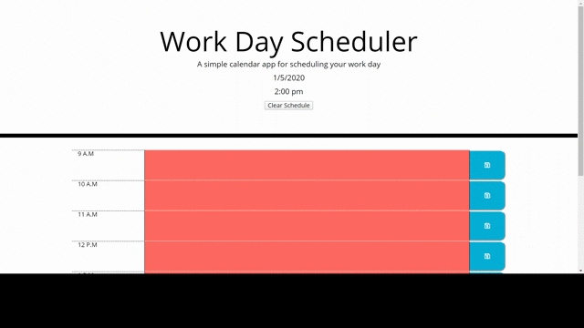

# DayPlanner

 
This application is for anyone who wants to have a planner to write down their important tasks. The user can write whatever they want in the textbox area and once they hit the save box it is saved to the local storage.

# Credits
This project had some minor bumps along the way and I had help from the following
<ul>
   <li> Erik Huyen (Classmate) 
      
 Erik helped me out with the whole troubleshoot of the program not showing the proper colors when it was either past, present, or future. 
   <li> Christopher Ellis </li>
      
 Chris helped me with the whole get part of the localStorage.
   <li> W3Schools
   <li> JQuery
     
# Usage 
Anyone can use this code as a reference.
